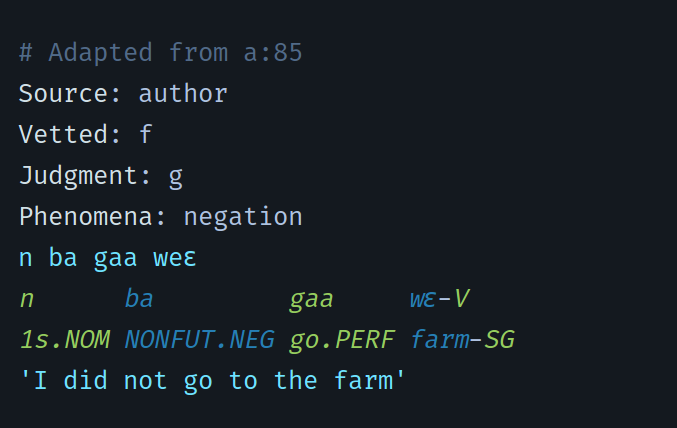
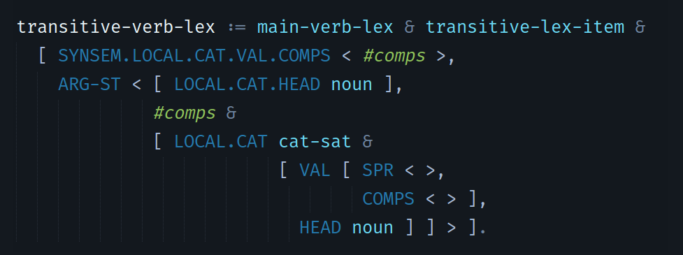

# Delphin Assistant
This package lets [Sublime Text 3](https://www.sublimetext.com/) handle certain file types maintained by the [DELPH-IN Consortium](http://moin.delph-in.net) elegantly.

## Features
* Syntax highlighting for TDL, [incr tsdb()] testsuites, and VPM files
* Commenting shortcut with `CTRL+/`
* [incr tsdb()] test snippet

### [incr tsdb()] syntax:

### TDL syntax:

## Installation
The recommended installation method is to use Sublime's [Package Control](https://packagecontrol.io/).

The package can also be installed directly; assuming you have git installed, the commands for the various operating systems are:

* Windows: `git clone https://github.com/adoxography/delphin-assistant "%APPDATA%/Sublime Text 3/Packages/"`
* OS X: `git clone https://github.com/adoxography/delphin-assistant "~/Library/Application Support/Sublime Text 3/Packages/"`
* Linux: `git clone https://github.com/adoxography/delphin-assistant ~/.config/sublime-text-3/Packages/`

After installation, all relevant features are available in files with the extensions .tdl, .vpm, and .tsdb for TDL files, VPM files, and [incr tsdb()] testsuites, respectively.

## Usage

### [incr tsdb()] syntax
All [incr tsdb()] tests are expected to begin with the following four lines, in order:
* Source
* Vetted
* Judgment
* Phenomena

To ensure that these lines are created in the correct order, the package comes with a `test` snippet which will generate the shell of a test for you: just type "test" and press `TAB` while in a .tsdb file.

Subsequent lines are open to user customization. The Delphin Assistant reads from the first line it finds in the testsuite that begins with `Lines:` to determine the number of lines that should follow the four lines mentioned earlier. By default, it will highlight any line labelled orth-seg or gloss by token, such that odd-numbered tokens are a different colour than even-numbered tokens. To adjust which lines should be token-separated, browse to `Preferences -> Package Settings -> Delphin Assistant -> Settings` and in your user settings, create a key/value pair for `"tsdb_tokenized_lines"`. Note that the value must be an array.

By default, tokens will be separated by whitespace and the following characters: ``!#$%&()*+,-./:;<=>?@[]^_\`{|}~\``. These characters can be changed by adjusting the `"tsdb_split"` value in your Delphin Assistant user preferences. Note that splitting on the single quote (`'`) is not supported at this time.

## To do
* Add an internal sublime command for compiling testsuites

*This plugin is developed and maintained independently of the DELPH-IN Consortium.*
